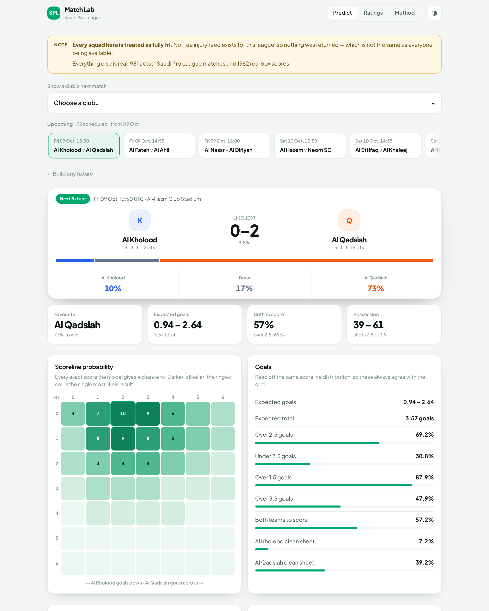
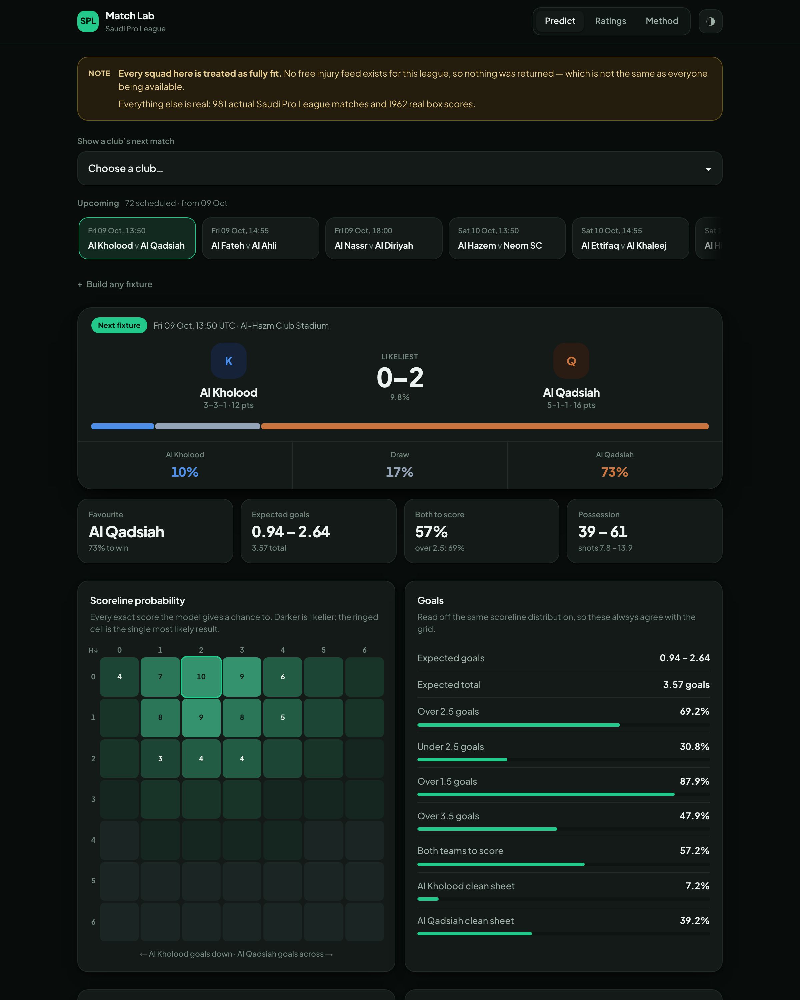
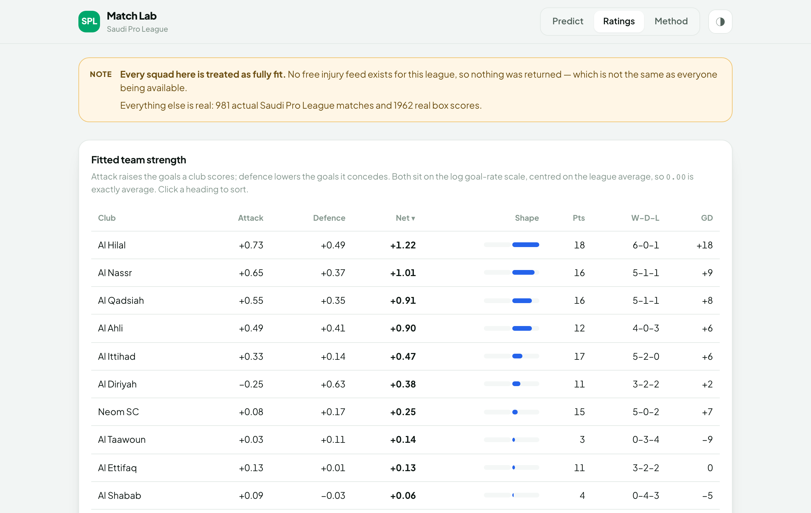
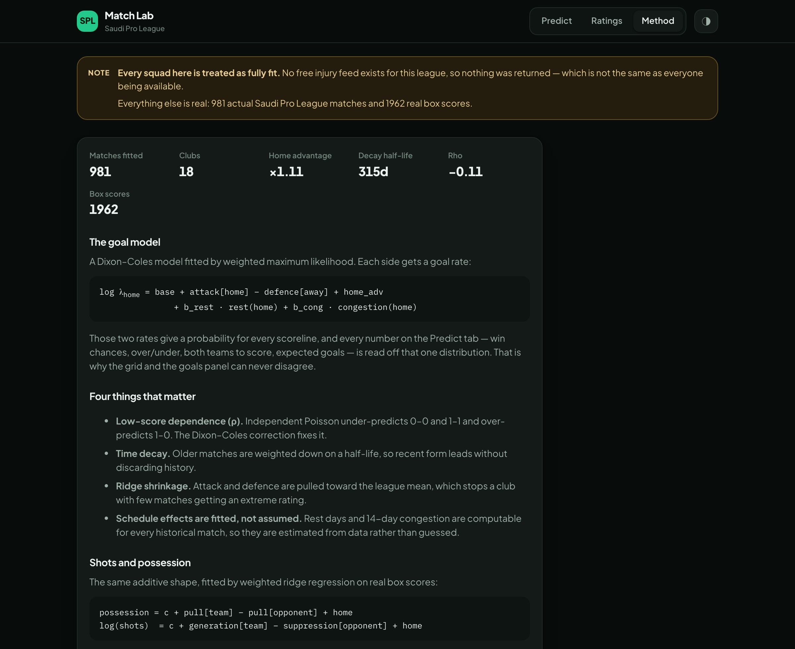
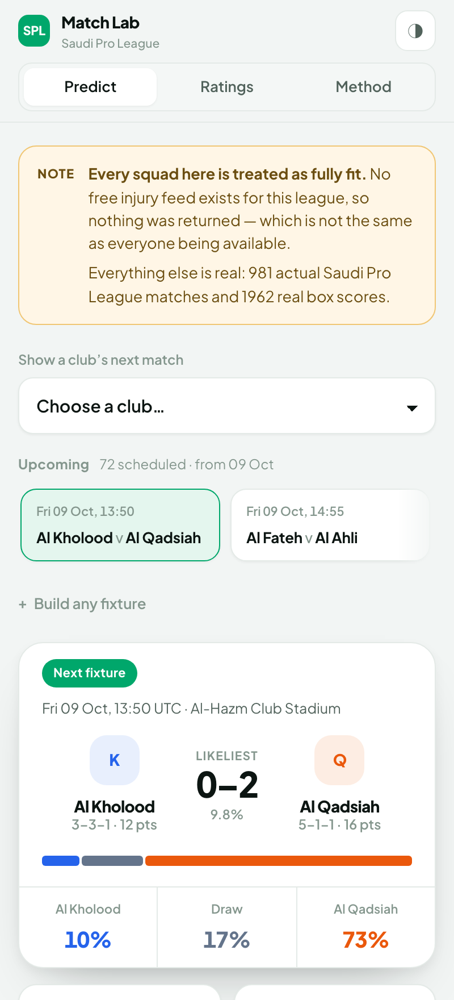

# Saudi Pro League match predictor

Predicts Saudi Pro League matches from live data: result probabilities, goals
scored and conceded, shots, shots on target, possession and corners — with the
reasoning behind each number shown alongside it.



Inputs the model uses, as asked for:

| Input | How it is used |
|---|---|
| Previous matchups | Time-weighted head-to-head, applied as a *residual* bias net of what the ratings already imply, so a rivalry effect is not double-counted |
| General squad | Each player's share of team minutes this season sets how much their absence matters |
| Current injuries | Live injury list → importance-weighted availability index, split into attack and defence effects by position |
| Rest days | Days since each club's last match **in any competition** (league, King's Cup, AFC Champions League), fitted as a coefficient |
| Home advantage | Fitted from the league's own results, not assumed |

## Setup

```bash
python3 -m venv .venv
.venv/bin/pip install -r requirements.txt
.venv/bin/python -m spl.cli fetch      # no key needed
```

That's it. The default data source is **free and needs no API key, no signup and
no quota**.

### Data sources

| | `--source espn` (default) | `--source api-football` |
|---|---|---|
| Cost | free, no key | key required |
| Current season | **yes** | paid plans only |
| History | 2022-23 onward | plan-dependent |
| Box scores | **included with every fixture** | 1 request each |
| Injuries | none published for this league | paid plans only |
| Rate limit | none observed | 10/min, 100/day on free |

ESPN's public JSON endpoints return a whole month of fixtures *with their box
scores* in one request, so a four-season snapshot with ~2,000 team-match box
scores costs about 40 requests and takes under a minute.

API-Football remains supported because it is the route to injury data. Its free
tier, though, serves only older seasons — for this league it refuses everything
after season 2024 — so on a free key it cannot tell you about the season being
played. To use it:

```bash
cp .env.example .env                              # paste your key
.venv/bin/python -m spl.cli fetch --source api-football
```

## Use

```bash
.venv/bin/python -m spl.cli fetch                 # pull live data into ./data
.venv/bin/python -m spl.cli predict --home "Al Hilal" --away "Al Nassr"
.venv/bin/python -m spl.cli next --days 10        # every upcoming fixture
.venv/bin/python -m spl.cli backtest              # walk-forward accuracy check
.venv/bin/python -m spl.cli ratings               # fitted attack/defence table
.venv/bin/python -m spl.cli status                # snapshot age + API quota left
```

Club names are fuzzy-matched, so `--home hilal` and `--home "Al-Hilal Saudi FC"`
both work, and `ittihad` vs `ittifaq` resolve correctly. Add `--json` for machine
output, `-v` for the full log-rate decomposition, `--date YYYY-MM-DD` to predict a
hypothetical fixture, `--neutral` to drop home advantage.

Every response is cached on disk, so `--offline` replays the last snapshot without
spending quota, and repeated predictions cost nothing.

## The web UI

A self-contained page — no server, no build step beyond one script, nothing hosted
anywhere:

```bash
.venv/bin/python -m spl.cli fetch                       # once, needs an API key
.venv/bin/python -m spl.cli export --out ui/data.json   # precompute every pairing
python3 ui/build.py                                     # build the page
open ui/index.html                                      # done
```

`ui/data.json` is not in the repository: it is derived from the data provider's
feed, and their terms do not permit redistributing it. Run `fetch` then `export`
with your own key and it is generated locally.

`ui/index.html` is a single standalone file. Double-click it. It works offline
(web fonts fall back to system faces) and sends no requests anywhere.

Pick a club and it opens their **real next fixture** — correct sides, kickoff time
and venue — or click along the strip of upcoming matches. A pairing that is not
actually scheduled is labelled *Hypothetical*, so a real fixture and an invented
matchup never look alike.

### Predict

Win probabilities and fair odds, summary tiles, a scoreline probability grid, the
goals markets, opposing bars for possession, shots, shots on target and corners,
and the inputs that moved the numbers.



### Ratings

Fitted attack and defence for every club, sortable, next to their real league
record. The two orders disagree, which is the time decay doing its job.



### Method, and on a phone

The model, its assumptions and its limits are written into the page itself. The
whole thing reflows to phone width.

<p>


</p>

The page does **no modelling**. `export` precomputes all 306 club pairings with the
same Python code the test suite covers, so the page and the command line cannot
disagree. `ui/build.py` also emits `ui/artifact.html`, the same page as a fragment
for hosting somewhere that supplies its own HTML skeleton.

Re-run all three commands after each `fetch` to refresh the page.

## How it works

**Goals.** A Dixon-Coles model. Each side's goal rate is

```
log λ_home = base + attack[home] − defence[away] + home_adv
                  + b_rest·rest_z(home) + b_cong·congestion(home)
log λ_away = base + attack[away] − defence[home]
                  + b_rest·rest_z(away) + b_cong·congestion(away)
```

fitted by weighted maximum likelihood, then turned into a full scoreline
distribution from which every quoted number is derived. Four things matter here:

- **Low-score dependence (ρ).** Independent Poisson under-predicts 0-0 and 1-1 and
  over-predicts 1-0. The Dixon-Coles correction fixes that; the fitted ρ is
  negative, which is what lifts the draw.
- **Time decay.** Matches are weighted `exp(−0.0022 · days_ago)`, a ~315-day
  half-life, so recent form dominates without throwing away history.
- **Ridge shrinkage.** Attack and defence are pulled toward the league mean, which
  is what stops a promoted club with six matches played from getting an extreme
  rating.
- **Schedule effects are fitted, not assumed.** Rest days and 14-day congestion are
  computable for every historical match, so they are estimated from data.

**Shots and possession.** The same additive structure, fitted by weighted ridge
regression on per-team box scores:

```
possession_ij = c + p_i − p_j + home        (identity link, so the two sides sum to 100)
log(shots_ij) = c + s_i − q_j + home        (log link, so effects are multiplicative)
```

`p_i` is a club's possession pull, `q_j` the opponent's shot suppression. The design
is antisymmetric in (team, opponent), which is what makes the two halves of a
predicted match consistent with each other. With no box scores available it falls
back to league priors scaled by the goal model's rates, and says so in the output.

**Injuries.** Every player's share of team minutes is already their share of the
eleven — an ever-present starter plays 38×90 of the team's 38×11×90 minutes, i.e.
1/11. So the minutes share is used directly as the cost of the absence, split
across attack and defence by position, with "questionable" counted at partial
weight. Absences then move goal rate, shots and possession through the elasticities
in `spl/config.py`.

## Does it actually work?

`backtest` refits the model on matches strictly before each kickoff and scores the
prediction it would have made — the only honest test, because attack/defence
ratings can otherwise memorise results. It reports log loss, RPS, Brier, accuracy,
goal/shot/possession error and a calibration table, against a league base-rate
baseline. Run it on your own snapshot before trusting any number here.

`.venv/bin/python -m unittest discover -s tests -t .` runs 163 tests. Most assert
recovery: a league is simulated from known parameters and the fit has to find them
back (home advantage recovers to within 0.006 of truth averaged over seeds, attack
ratings correlate ~0.93).

## If you use the API-Football source

Its **free tier serves only a window of past seasons** — for this league it refuses
everything after season 2024 with *"Free plans do not have access to this season,
try from 2022 to 2024"*. That limit cascades: the team list, squads, injuries and
upcoming fixtures are all requested for the *current* season, so on a free key they
fail together.

The pipeline handles this rather than falling over. It asks for a five-season
window, keeps whatever the plan serves, then points every later stage at the
**newest season that actually loaded**, and labels the snapshot as historical so no
report implies it is current. The free tier is also capped at **10 requests/minute**,
which is why that fetch paces itself at ~9/min.

This is why `espn` is the default: for everything except injuries it is both free
and more current.

## Honest limitations

- **The injury elasticity is a prior, not a fitted coefficient.** Historical
  per-fixture injury lists are not retrievable cheaply, so there is no data to fit
  it on. The default assumes losing 20% of importance-weighted attacking minutes
  costs ~10% of goal rate. It is a documented assumption in `spl/config.py`, and
  `--ignore-injuries` shows the counterfactual.
- **The rest-days effect is weakly identified.** One season gives a standard error
  near 0.07 on that coefficient — big enough that an unregularised fit will happily
  report that *more* rest hurts. A Gaussian prior (`schedule_prior_sd`) shrinks it
  instead. In testing this halved the coefficient's error at equal out-of-sample log
  loss.
- **Box scores cost one request each.** `--stats-limit` caps how many recent
  matches are pulled, and the shots and possession models are only as good as that
  sample. A full fetch for an 18-club league costs roughly:

  | call | count |
  |---|---|
  | league + season discovery | 2 |
  | league fixtures | 1 per season |
  | team list, injuries | 2 |
  | other competitions (for rest days) | 1 per club (~18) |
  | player minutes | ~2 per club (~36) |
  | box scores | 1 per match (`--stats-limit`, default 30) |

  That is ~94 against the free tier's 100/day, which is why the default is 30 and
  not more. Box scores are fetched **last**, so if the quota runs out mid-fetch you
  lose only shot/possession precision — fixtures, injuries and rest days are
  already in. `--no-players`, `--no-schedule` and `--no-stats` each trade a chunk
  of the budget for a named loss of accuracy.
- **No free injury feed exists for this league.** ESPN publishes an injuries
  endpoint but returns an empty list for the Saudi Pro League, and API-Football
  carries injuries only on a season its free tier cannot reach. So squads show as
  100% available because nothing was returned, not because everyone is fit — every
  report says so explicitly rather than implying full fitness. The injury model is
  built and tested; it is waiting on a feed.
- **No lineup or transfer-window awareness.** A club that sold its top scorer looks
  unchanged until enough matches accumulate. Minutes-weighted ratings adapt within a
  few weeks, not immediately.
- **Predictions are probabilistic.** A 55% favourite loses 45% of the time. The
  calibration table in `backtest` is the thing to judge, not whether single calls
  came in.

## License

MIT — see [LICENSE](LICENSE). The match data itself is not covered by this licence
and is not redistributed here; it belongs to the data provider and needs your own
API key.

## Layout

```
LICENSE                        MIT
ui/src/                        page sources: styles.css, page.html, app.js
ui/build.py                    builds ui/index.html (standalone) + artifact.html
spl/export.py                  precompute every pairing as JSON for the page
spl/providers/espn.py          free data client: no key, month-at-a-time, cached
spl/providers/apifootball.py   keyed client: disk cache, TTLs, request budget
spl/data.py                    normalise payloads; Dataset save/load; name matching
spl/features.py                rest, congestion, availability, head-to-head, form
spl/model.py                   Dixon-Coles fit + scoreline matrix + markets
spl/aux_models.py              shots / shots-on-target / possession / corners
spl/backtest.py                walk-forward evaluation and calibration
spl/predict.py                 orchestration and the report you see
spl/cli.py                     command line interface
tests/synthetic.py             simulated league with known parameters
```
