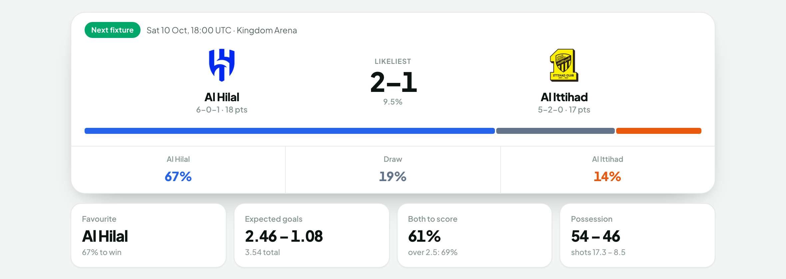
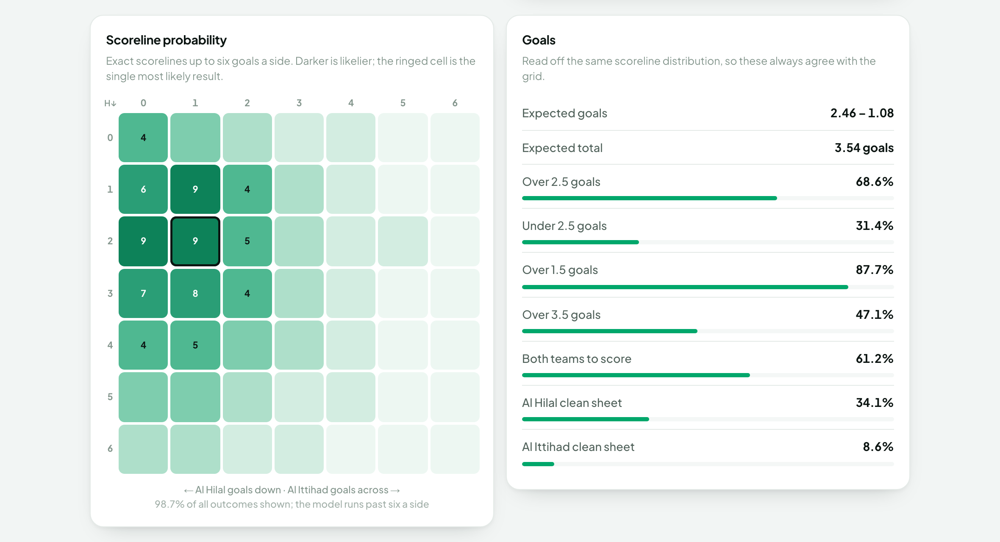
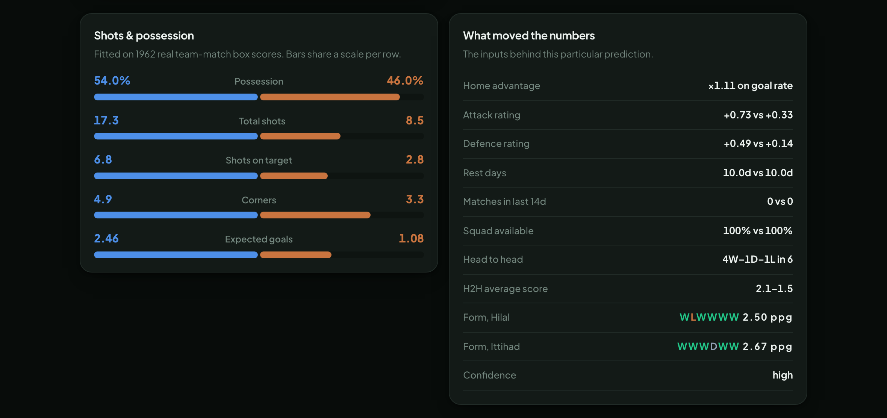
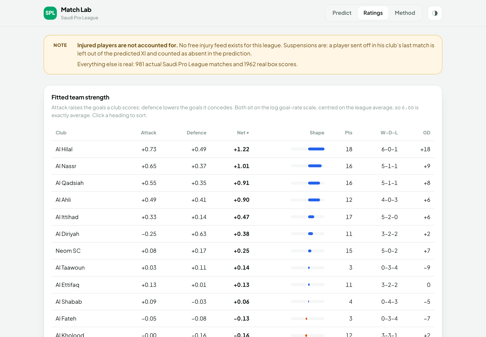
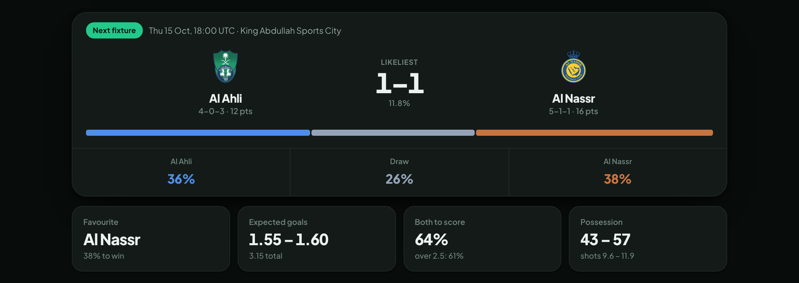
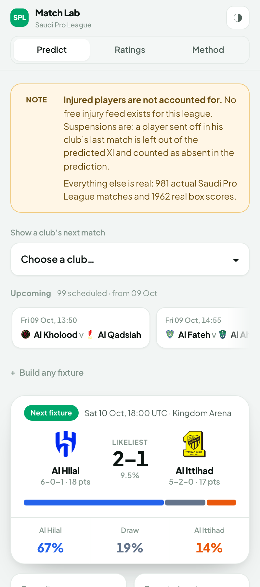
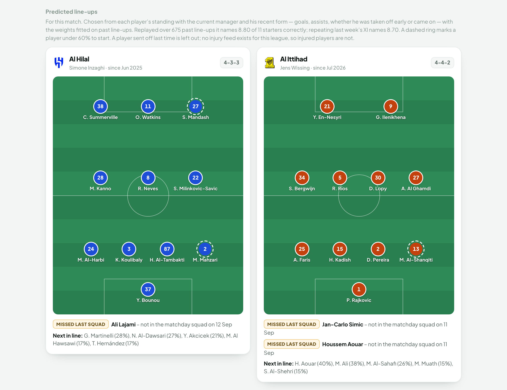

# Saudi Pro League match predictor

Predicts Saudi Pro League matches from live data: result probabilities, goals
scored and conceded, shots, shots on target, possession and corners — with the
reasoning behind each number shown alongside it.



Inputs the model uses, as asked for:

| Input | How it is used |
|---|---|
| Previous matchups | Time-weighted head-to-head, applied as a *residual* bias net of what the ratings already imply, so a rivalry effect is not double-counted |
| General squad | Each club's registered squad and its players' minutes over the last 10 line-ups set how much an absence matters — and drive the **predicted XI** |
| Current injuries | Importance-weighted availability index, split into attack and defence by position. No free injury feed exists for this league, so today this counts **red-card suspensions** read from the line-ups; an injury list from a paid feed plugs into the same path |
| Rest days | Days since each club's last match **in any competition** (league, King's Cup, AFC Champions League), fitted as a coefficient |
| Home advantage | Fitted from the league's own results, not assumed |

## Setup

```bash
python3 -m venv .venv
.venv/bin/pip install -r requirements.txt
.venv/bin/python -m spl.cli fetch      # no key needed
```

That's it. The default data source is **free and needs no API key, no signup and
no quota**.

### Data sources

| | `--source espn` (default) | `--source api-football` |
|---|---|---|
| Cost | free, no key | key required |
| Current season | **yes** | paid plans only |
| History | 2022-23 onward | plan-dependent |
| Box scores | **included with every fixture** | 1 request each |
| Injuries | none published for this league | paid plans only |
| Rate limit | none observed | 10/min, 100/day on free |

ESPN's public JSON endpoints return a whole month of fixtures *with their box
scores* in one request, so a four-season snapshot with ~2,000 team-match box
scores costs about 40 requests and takes under a minute.

API-Football remains supported because it is the route to injury data. Its free
tier, though, serves only older seasons — for this league it refuses everything
after season 2024 — so on a free key it cannot tell you about the season being
played. To use it:

```bash
cp .env.example .env                              # paste your key
.venv/bin/python -m spl.cli fetch --source api-football
```

## Use

```bash
.venv/bin/python -m spl.cli fetch                 # pull live data into ./data
.venv/bin/python -m spl.cli predict --home "Al Hilal" --away "Al Nassr"
.venv/bin/python -m spl.cli next --days 10        # every upcoming fixture
.venv/bin/python -m spl.cli backtest              # walk-forward accuracy check
.venv/bin/python -m spl.cli ratings               # fitted attack/defence table
.venv/bin/python -m spl.cli status                # snapshot age + API quota left
```

Club names are fuzzy-matched, so `--home hilal` and `--home "Al-Hilal Saudi FC"`
both work, and `ittihad` vs `ittifaq` resolve correctly. Add `--json` for machine
output, `-v` for the full log-rate decomposition, `--date YYYY-MM-DD` to predict a
hypothetical fixture, `--neutral` to drop home advantage.

Every response is cached on disk, so `--offline` replays the last snapshot without
spending quota, and repeated predictions cost nothing.

## The web UI

A self-contained page — no server, no build step beyond one script, nothing hosted
anywhere:

```bash
.venv/bin/python -m spl.cli fetch                       # once, needs an API key
.venv/bin/python -m spl.cli export --out ui/data.json   # precompute every pairing
python3 ui/build.py                                     # build the page
open ui/index.html                                      # done
```

`ui/data.json` is not in the repository: it is derived from the data provider's
feed, and their terms do not permit redistributing it. Run `fetch` then `export`
with your own key and it is generated locally.

`ui/index.html` is a single standalone file. Double-click it. It works offline
and sends no requests anywhere: club badges are downscaled and embedded as data
URIs rather than hot-linked, and the web fonts fall back to system faces.

Pick a club and it opens their **real next fixture** — correct sides, kickoff time
and venue — or click along the strip of upcoming matches. A pairing that is not
actually scheduled is labelled *Hypothetical*, so a real fixture and an invented
matchup never look alike.

### Predict

Win probabilities and fair odds, then every exact scoreline the model gives a
chance to. The goals markets are read off that same distribution, so the grid and
the panel beside it can never disagree.



Shots, possession, shots on target and corners come from models fitted on real box
scores — and the panel beside them shows exactly which inputs moved this
prediction, down to rest days and head-to-head.



### Ratings

Fitted attack and defence for every club, sortable, next to their real league
record. The two orders disagree, which is the time decay doing its job.



### Any fixture, any screen

Pick any of the 306 pairings, in either theme, at any width.

<p>


</p>

The page does **no modelling**. `export` precomputes all 306 club pairings with the
same Python code the test suite covers, so the page and the command line cannot
disagree. `ui/build.py` also emits `ui/artifact.html`, the same page as a fragment
for hosting somewhere that supplies its own HTML skeleton.

Re-run all three commands after each `fetch` to refresh the page.

## Squad predictor

```bash
.venv/bin/python -m spl.cli lineup --team hilal       # likely XI for their next match
.venv/bin/python -m spl.cli lineup --evaluate         # how often it is right
```

The likely starting XI for each club's next match, from each player's
**standing with the current manager** and his **recent performance**. Line-ups
come from the same free source as the results — formation, each starter's slot
and position, substitutions, cards, goals and assists — and each club's
manager on any date comes from the managerial-changes tables on Wikipedia's
season pages, since no free football API publishes coaches for this league.

Each player gets a chance of starting from a logistic model fitted on every
recorded line-up. What it learned, as odds of starting:

| signal | effect |
|---|---|
| share of starts under the **current manager** (0 → 1) | ×10.8 |
| started last week, but for a **different manager** | ×0.31 |
| started last week | ×3.6 |
| came on as a substitute last week | ×3.0 |
| **taken off before the hour** last week | ×0.17 |
| goals + assists per 90, recent outings (per 1) | ×1.5 |
| started a defeat last week | ×0.81 |

The best goalkeeper and ten outfielders make the XI, kept to the balance of
defence, midfield and attack the side used last time. A player **sent off in
the club's last match** is suspended for the next fixture: never picked, and
counted as absent by the goal model.

Replayed over 675 past line-ups, with the model cross-validated in
chronological blocks so no line-up is predicted by a model that saw it:

| | starters named right |
|---|---|
| **manager preference + form model** | **8.80 of 11** |
| last week's XI, less suspensions | 8.76 of 11 |
| repeat last week's XI | 8.70 of 11 |

The gain is real but modest (t = 2.1). It is largest just after a manager
change, where a new man reshapes the side — about a third of a player per
line-up, though there are too few such matches in the data to be sure. The
model's chances are well calibrated: players given 90% or more started 90% of
the time. Ideas that did not help were left out, and are recorded in
[spl/squad.py](spl/squad.py).

It cannot see injuries. An injured player drops out as his recent record
fades; a regular missing from the last squad is flagged *missed last squad*
rather than removed, since nobody publishes whether he was injured or rested.
The registered squad list keeps players who have left the club out of the XI.

On the page, both sides' XIs are drawn on pitches in the manager's usual
shape, with the manager's name and tenure, and a dashed ring on anyone under
60% to start.



## How it works

**Goals.** A Dixon-Coles model. Each side's goal rate is

```
log λ_home = base + attack[home] − defence[away] + home_adv
                  + b_rest·rest_z(home) + b_cong·congestion(home)
log λ_away = base + attack[away] − defence[home]
                  + b_rest·rest_z(away) + b_cong·congestion(away)
```

fitted by weighted maximum likelihood, then turned into a full scoreline
distribution from which every quoted number is derived. Four things matter here:

- **Low-score dependence (ρ).** Independent Poisson under-predicts 0-0 and 1-1 and
  over-predicts 1-0. The Dixon-Coles correction fixes that; the fitted ρ is
  negative, which is what lifts the draw.
- **Time decay.** Matches are weighted `exp(−0.0022 · days_ago)`, a ~315-day
  half-life, so recent form dominates without throwing away history.
- **Ridge shrinkage.** Attack and defence are pulled toward the league mean, which
  is what stops a promoted club with six matches played from getting an extreme
  rating.
- **Schedule effects are fitted, not assumed.** Rest days and 14-day congestion are
  computable for every historical match, so they are estimated from data.

**Shots and possession.** The same additive structure, fitted by weighted ridge
regression on per-team box scores:

```
possession_ij = c + p_i − p_j + home        (identity link, so the two sides sum to 100)
log(shots_ij) = c + s_i − q_j + home        (log link, so effects are multiplicative)
```

`p_i` is a club's possession pull, `q_j` the opponent's shot suppression. The design
is antisymmetric in (team, opponent), which is what makes the two halves of a
predicted match consistent with each other. With no box scores available it falls
back to league priors scaled by the goal model's rates, and says so in the output.

**Injuries.** Every player's share of team minutes is already their share of the
eleven — an ever-present starter plays 38×90 of the team's 38×11×90 minutes, i.e.
1/11. So the minutes share is used directly as the cost of the absence, split
across attack and defence by position, with "questionable" counted at partial
weight. Absences then move goal rate, shots and possession through the elasticities
in `spl/config.py`.

## Does it actually work?

`backtest` refits the model on matches strictly before each kickoff and scores the
prediction it would have made — the only honest test, because attack/defence
ratings can otherwise memorise results. It reports log loss, RPS, Brier, accuracy,
goal/shot/possession error and a calibration table, against a league base-rate
baseline. Run it on your own snapshot before trusting any number here.

`.venv/bin/python -m unittest discover -s tests -t .` runs 312 tests. Most assert
recovery: a league is simulated from known parameters and the fit has to find them
back (home advantage recovers to within 0.006 of truth averaged over seeds, attack
ratings correlate ~0.93).

## If you use the API-Football source

Its **free tier serves only a window of past seasons** — for this league it refuses
everything after season 2024 with *"Free plans do not have access to this season,
try from 2022 to 2024"*. That limit cascades: the team list, squads, injuries and
upcoming fixtures are all requested for the *current* season, so on a free key they
fail together.

The pipeline handles this rather than falling over. It asks for a five-season
window, keeps whatever the plan serves, then points every later stage at the
**newest season that actually loaded**, and labels the snapshot as historical so no
report implies it is current. The free tier is also capped at **10 requests/minute**,
which is why that fetch paces itself at ~9/min.

This is why `espn` is the default: for everything except injuries it is both free
and more current.

## Honest limitations

- **The injury elasticity is a prior, not a fitted coefficient.** Historical
  per-fixture injury lists are not retrievable cheaply, so there is no data to fit
  it on. The default assumes losing 20% of importance-weighted attacking minutes
  costs ~10% of goal rate. It is a documented assumption in `spl/config.py`, and
  `--ignore-injuries` shows the counterfactual.
- **The rest-days effect is weakly identified.** One season gives a standard error
  near 0.07 on that coefficient — big enough that an unregularised fit will happily
  report that *more* rest hurts. A Gaussian prior (`schedule_prior_sd`) shrinks it
  instead. In testing this halved the coefficient's error at equal out-of-sample log
  loss.
- **Box scores cost one request each.** `--stats-limit` caps how many recent
  matches are pulled, and the shots and possession models are only as good as that
  sample. A full fetch for an 18-club league costs roughly:

  | call | count |
  |---|---|
  | league + season discovery | 2 |
  | league fixtures | 1 per season |
  | team list, injuries | 2 |
  | other competitions (for rest days) | 1 per club (~18) |
  | player minutes | ~2 per club (~36) |
  | box scores | 1 per match (`--stats-limit`, default 30) |

  That is ~94 against the free tier's 100/day, which is why the default is 30 and
  not more. Box scores are fetched **last**, so if the quota runs out mid-fetch you
  lose only shot/possession precision — fixtures, injuries and rest days are
  already in. `--no-players`, `--no-schedule` and `--no-stats` each trade a chunk
  of the budget for a named loss of accuracy.
- **No free injury feed exists for this league.** ESPN publishes an injuries
  endpoint but returns an empty list for the Saudi Pro League, and API-Football
  carries injuries only on a season its free tier cannot reach. Red-card
  suspensions are read from the line-ups and counted; injuries are not, and
  every report says so.
- **No lineup or transfer-window awareness.** A club that sold its top scorer looks
  unchanged until enough matches accumulate. Minutes-weighted ratings adapt within a
  few weeks, not immediately.
- **Total goals look slightly high in mismatches.** Out of sample, the residual
  in total goals rises with the size of the predicted gap: about level in even
  fixtures, roughly half a goal too high where one side is a strong favourite.
  Regressing that residual on the predicted gap gives a slope of +0.27 with a
  t of 2.05 over 366 matches — weak evidence, and one of several comparisons
  made, so it may be noise. The margin itself is well scaled: regressing actual
  supremacy on predicted gives a slope of 0.987, indistinguishable from 1. No
  correction has been applied, because fitting one to 366 matches would more
  likely capture the noise than the effect.
- **Predictions are probabilistic.** A 55% favourite loses 45% of the time. The
  calibration table in `backtest` is the thing to judge, not whether single calls
  came in.

## License

MIT — see [LICENSE](LICENSE). The match data itself is not covered by this licence
and is not redistributed here; it belongs to the data provider and needs your own
API key.

## Layout

```
LICENSE                        MIT
ui/src/                        page sources: styles.css, page.html, app.js
ui/build.py                    builds ui/index.html (standalone) + artifact.html
spl/export.py                  precompute every pairing as JSON for the page
spl/providers/espn.py          free data client: results, box scores, line-ups, squads
spl/squad.py                   squad predictor: start model, suspensions, replay accuracy
spl/providers/wikipedia.py     managers over time, from Wikipedia season pages
spl/providers/apifootball.py   keyed client: disk cache, TTLs, request budget
spl/data.py                    normalise payloads; Dataset save/load; name matching
spl/features.py                rest, congestion, availability, head-to-head, form
spl/model.py                   Dixon-Coles fit + scoreline matrix + markets
spl/aux_models.py              shots / shots-on-target / possession / corners
spl/backtest.py                walk-forward evaluation and calibration
spl/predict.py                 orchestration and the report you see
spl/cli.py                     command line interface
tests/synthetic.py             simulated league with known parameters
```
